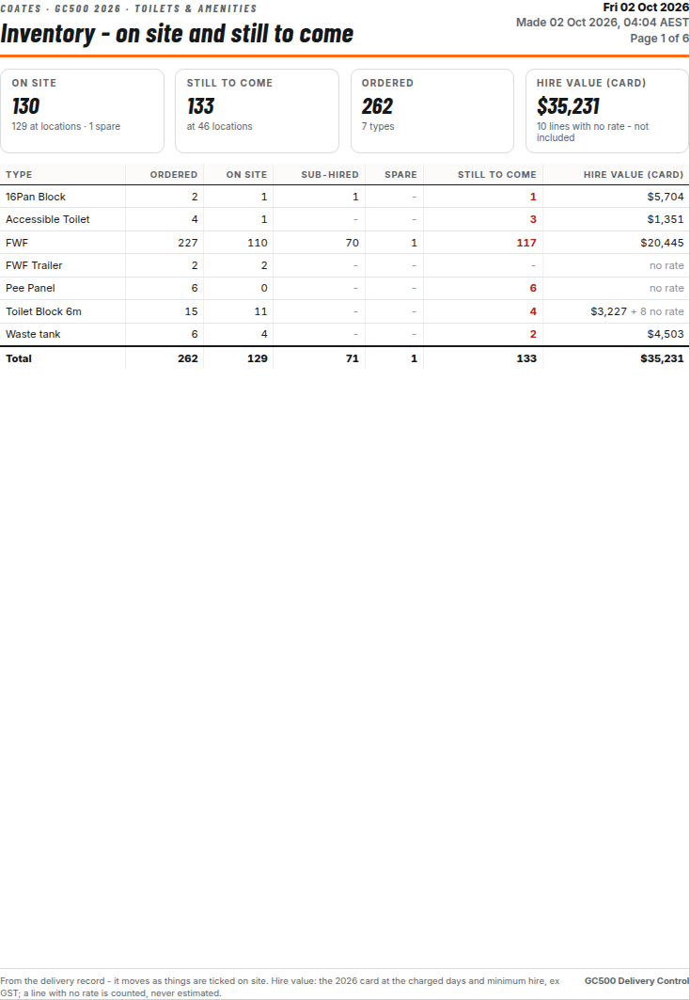
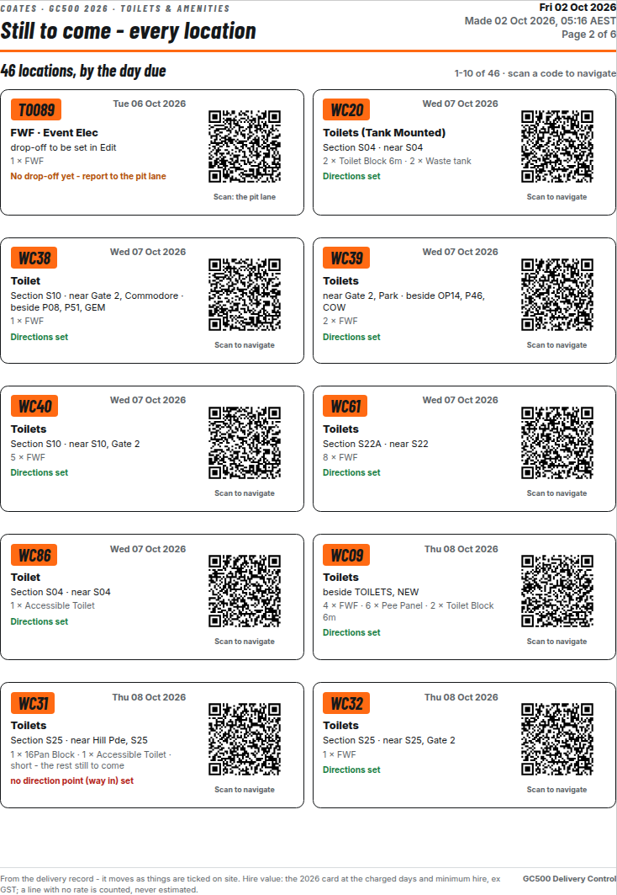

# v7.83 — Inventory: Share PDF (DRAFT)

Author: Andrew Fisher · 2 Oct 2026 · applied on top of v7.82 (`patch_v782.py`, then `patch_v783.py`)

## What Andrew asked (2 Oct 2026)

> "Let's have a share button that does a beautiful PDF print out on A4 on this info too. Costed PDF print out — 1 page
> is ideal; if 1 page is no good we can do 2 pages landscape. Missing locations: let's add a QR code for each, on
> navigation to that location. If we need another page, add another. Clean and tidy and easy — or ideas to improve
> this print out, let me know."

## What it does

The Inventory card gets a **Share PDF** button. It makes the PDF on this device from whatever the Inventory card is
showing (one trade, or every trade).

| Page | What's on it |
|---|---|
| Summary | Four tiles: on site, still to come, ordered, hire value. Then the table, one row per type: ordered, on site, sub-hired, spare, still to come, hire value. Totals at the bottom. **One A4 portrait page when it fits** (up to 34 rows). If it doesn't fit, **A4 landscape pages** (every trade takes two). |
| Still to come | Every location still to come, by the day it's due, **ten to an A4 page**. Each card shows the reference, the due day, where it goes, what's going and whether directions are set. It also has a **QR code**: scan it and the phone navigates to the drop-off. If there's no drop-off yet, the code goes to the pit lane. More pages are added as needed. |

- **Costing.**
  - Comes from `assetTotal()`, the same figure the Pricing tab shows: the 2026 card, the charged days and the minimum hire, ex GST.
  - A line with no rate is never estimated. It shows "no rate" and is counted, not added. The tile says how many.
- **Wording.** It follows the v7.82 rules:
  - "report to the pit lane", never "P33";
  - "drop-off to be set in Edit" where one is missing;
  - "no direction point (way in) set" for the few still without a way in.
- **Sharing.**
  - **Share** uses the phone's share sheet where it can. **Open** and **Save** always work.
  - Nothing is sent anywhere and nothing is written to the record.
  - File name: `GC500_Inventory_<trade or All>_<date>.pdf`.

## The pages (Toilets & amenities, 2 Oct 2026)

| Page 1 — summary (portrait) | Page 2 — still to come |
|---|---|
|  |  |

## Results

Build: `build/GC500_v7.83/GC500_Delivery_Control_hosted.html`, md5 `c15f364a…`, 8,758,340 bytes. It was built from
the live page plus v7.82 and v7.83. `check_page`: PASS, no keys.

`evidence/inventory_pdf_tests.js` passes **9/9 desktop and 9/9 phone**. It only makes GETs, the harness aborts any
write, and nothing is shared.

| Test | Result |
|---|---|
| F1 every trade: summary, then every location at ten a page | 116 locations, 14 pages (2 landscape + 12) |
| F2 portrait when it fits, else landscape | every trade: 51 table rows → 2 landscape pages |
| F3 every page fits its sheet | nothing cut off |
| F4 a QR code on every location | 116 of 116 |
| F5 costed from the Pricing figure | $200,062 priced; 37 lines with no rate counted, not added |
| F6 "P33" never printed as a destination | pass |
| F7 one trade fits one portrait summary page | Toilets & amenities: 7 types, 1 page + 5 location pages |
| F8 Share PDF makes the file and offers Open and Save | 6 pages, 2.7 MB, state ready |
| E1 no page errors | none |

The full regression on this build (the v7.82 suites plus the standing ones) is in `evidence/regress/`. See the
summary at the end of this file.

## Ideas to make it better (for Andrew to pick)

1. **"Fix before dispatch" box on page 1.**
   - A short red-bordered list of the references a driver can't leave with yet.
   - Today that's 39 with no drop-off (pit lane) and 9 with no way in, out of 116 still to come.
   - The person printing sees the gaps first.
2. **Next 3 days first.** Put a "due in the next 3 days" strip at the top of page 1 so the urgent loads stand out from
   the rest of the event.
3. **Trade subtotals** on the every-trade version. A hire value line per trade (toilets, generators, water barriers,
   light towers…) so the costs can be read by trade at a glance.
4. **Tick box per card**, so the site crew can mark each location off on the printed copy as it lands.

## Open questions

- **No way in yet (9).** The cards still say "no direction point (way in) set" until Andrew confirms the way in:
  - Turn 2 / Ferny Ave (S15): GN04, WB13, WB18, WB20, WC25, WC45, WC47;
  - WB07: Admiralty Dr;
  - WC31: S25 near Hill Pde.
- Same v7.82 open items: confirm Gate 1 (Tedder Ave access point) and Gate 2 (GC Hwy underpass via Commodore Dr); confirm
  the 05:00 morning-run scope.

## Who checked what

- Claude built it and ran the tests above, plus the full regression.
- Codex hasn't reviewed it yet. Under the 2 Oct arrangement, a second audit is optional.
