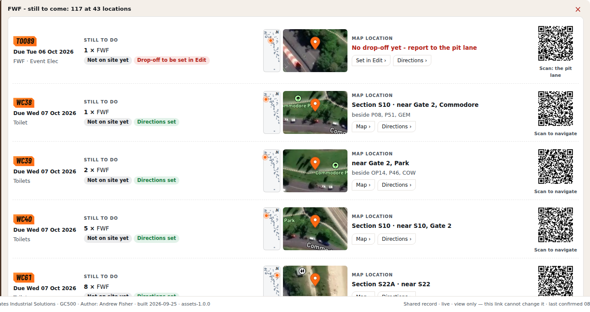
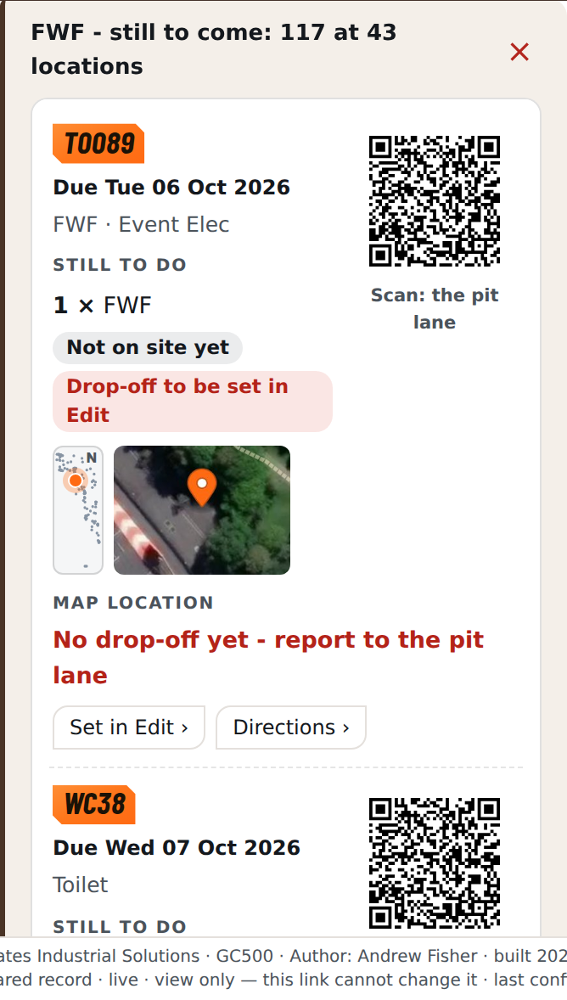
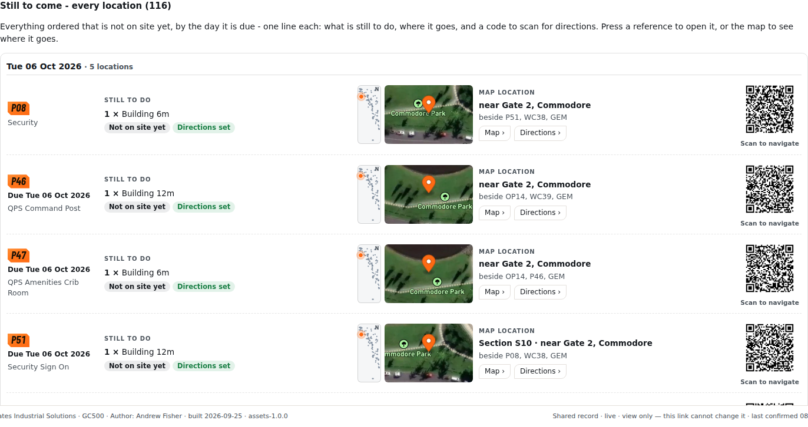
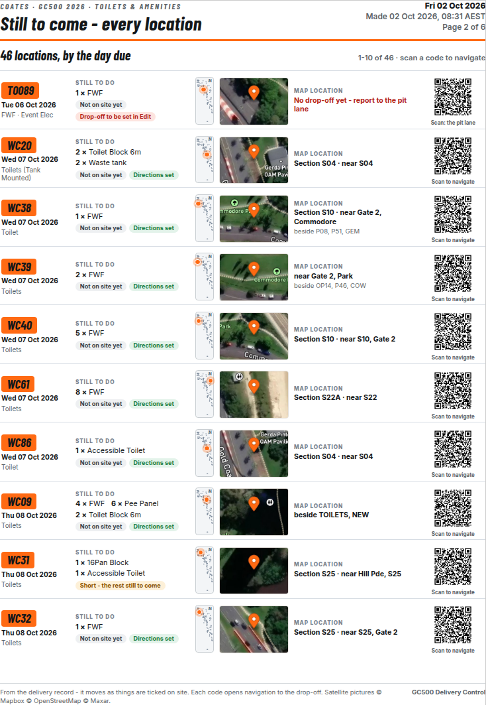

# v7.87 — Inventory: one line per location (LIVE)

Author: Andrew Fisher · 2 Oct 2026. It goes on after v7.86:

```
bash toolchain/build.sh v7.87 v7.87_inventory_one_line_LIVE/patch_v787.py
```

The final reviewed build gives **8,858,382 bytes, SHA-256 `d592847abc0d774502f53fc568f1bfaaff1706be7dd23a3a54a70a1552a4c367`**, built on live v7.86 `0513542d`.
The earlier handover candidate was `a39c652d`. Independent review found that the new per-type list displayed
reference and map buttons without binding their click actions. The final patch binds those controls in both lists;
the existing Directions links and navigation rules are unchanged. Published **2 Oct 2026 09:14 AEST**; the public view matches these bytes exactly. The shared record remains **3538**.
- The scrub changes nothing.
- `check_page` passes, with no keys in the page.

## What Andrew asked

These are Andrew's own words from 2 Oct 2026, quoted as he wrote them:

> "i want to see on the same line each location reference what still needs to be done and the same line the Map
> location and QR code — it might make some of these lines larger, show me some examples"

He was shown examples on desktop, phone and A4 (`../inventory_one_line_EXAMPLES/`) and asked to choose between a locator and a satellite picture, between the screen and the PDF, and on the QR size. His answer:

> "i want it all"

Then, on the Inventory table:

> "i still want to see here — we have still to come. i want the reference on this line, where each one that has not
> turned up goes, then a direct link to the location. this works out good for toilets so we know where to place"

## What it does

There is one line per location, and it is the same in three places.

| Where | What you press or see |
|---|---|
| **Inventory table, "Still to come" number** (e.g. FWF 117) | A list of every location where that type has not turned up, one line each, with its due day. |
| **"Still to come - every location"** on the Inventory card | The same lines for every trade, grouped by the day each location is due. |
| **Share PDF**, location pages | The same lines, ten to an A4 page. The summary page is unchanged. |

Each line carries:

- **The reference.** Pressing it opens the location on the form. The line also shows its name and, in the per-type list and on paper, its due day.
- **Still to do.**
  - Each item still to come, with how many.
  - Whether it is "Not on site yet" or "Short - the rest still to come".
  - The directions state: "Directions set", "Drop-off to be set in Edit", or what is missing.
- **Map location.**
  - A **locator**: the whole site as dots, with this spot in orange, north up.
  - A **satellite close-up** of the spot.
  - The words: Section · near · beside.
  - **Map ›** shows the location on the site map.
  - **Directions ›** opens navigation to the spot on the phone, which is the direct link Andrew asked for.
- **A full-size QR code.** It is the same navigation the drivers get. A location with no drop-off yet goes to the pit lane.

## How it behaves

- **Satellite pictures.**
  - They come from the Mapbox satellite imagery the live map already uses, through the same public key the service hands the page. No key is in the repo.
  - On screen, a picture is fetched only when its line scrolls into view.
  - With no key, no signal or no WebGL, the line keeps its locator and says "no satellite picture".
  - The PDF footer credits Mapbox, OpenStreetMap and Maxar.
- **Screen QR codes.** They are drawn only as their lines come into view, so 116 lines don't stall the page. The card draws in about 150 ms.
- **What stays the same.** Nothing is written to the record, and the costing is unchanged.
- **Checks still work.** The classes that the v7.82 and v7.83 checks read are kept.

## Pictures (live record, 2 Oct 2026)

| Still to come on FWF: desktop | Phone |
|---|---|
|  |  |

| Every location (desktop) | Share PDF, location page |
|---|---|
|  |  |

## Results

- **`evidence/one_line_tests.js`: 20/20 on desktop and 20/20 on phone on the final reviewed build.**
  - L1–L12 cover the every-location list:
    - all 116 locations are listed, each with what is still to do, the location words, the pin, the QR and the satellite picture;
    - the reference, the to-do and the QR sit on one line;
    - there is no sideways scroll;
    - QR codes and pictures load as their lines come into view, and match the drivers' navigation;
    - the card draws in time, and pressing the pictures opens the map.
  - D1–D4 cover pressing Still to come on the biggest toilet type (FWF, 43 locations):
    - every location gets a line;
    - each line has a due day and a place;
    - each line has a Directions link that equals the QR, which equals the drivers' navigation;
    - each line has its QR and satellite picture.
  - T1–T2: table references add up to each Still-to-come number, and open the selected location line.
  - E1–E2: no page errors, and nothing written.
- **`evidence/inventory_pdf_tests.js` (the v7.83 suite): 9/9 on desktop and 9/9 on phone.**
  - Every page fits its sheet.
  - All 116 locations have a QR code.
  - The costing is $200,062 (37 lines have no rate).
  - P33 is never printed as a destination.
  - Share PDF makes the file.
- **Full regression:** see `evidence/regress/` and STATUS.md.


## Final independent release check

The final candidate above is **LIVE, 2 Oct 2026 09:14 AEST**, verified at the public view byte for byte. The per-type list's reference, Map and locator
controls now work, including the fallback Set in Edit action through the same reference binding. The new
`evidence/drill_click_tests.js` dispatches real clicks and runs production navigation in both lists; it does not
replace navigation with a mock.

- Actual reference, Map and locator clicks: **8/8 desktop and 8/8 phone**.
- One-line Inventory: **20/20 desktop and 20/20 phone**.
- Share PDF: **9/9 desktop and 9/9 phone**.
- Both sweeps: **21 tabs, 7 deep links, zero page and console errors**.
- Six inline scripts parse, no new keys, official upload dry-run and fresh-base check pass.
- Phone layout and ten-location A4 page visually inspected. No record writes, journals or real messages.
- The official page-only upload completed after these checks; fresh public verification and unchanged record **3538** are recorded in `evidence/release_verification.json`.

Aggregate proof is `evidence/independent_review.json`; the phone view is `evidence/independent_phone.png`.
The earlier full regression remains recorded under `evidence/regress/`; only the two click-binding selectors changed
since that handover, and the relevant checks above were rerun on the final hash.
